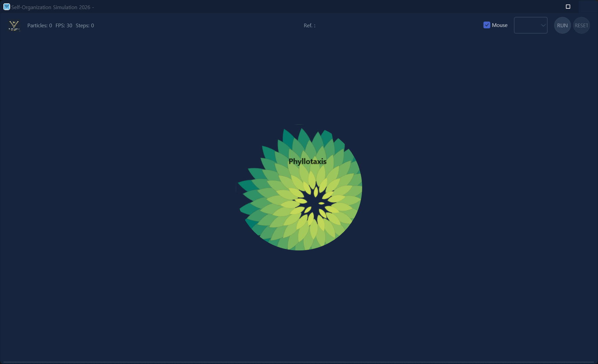
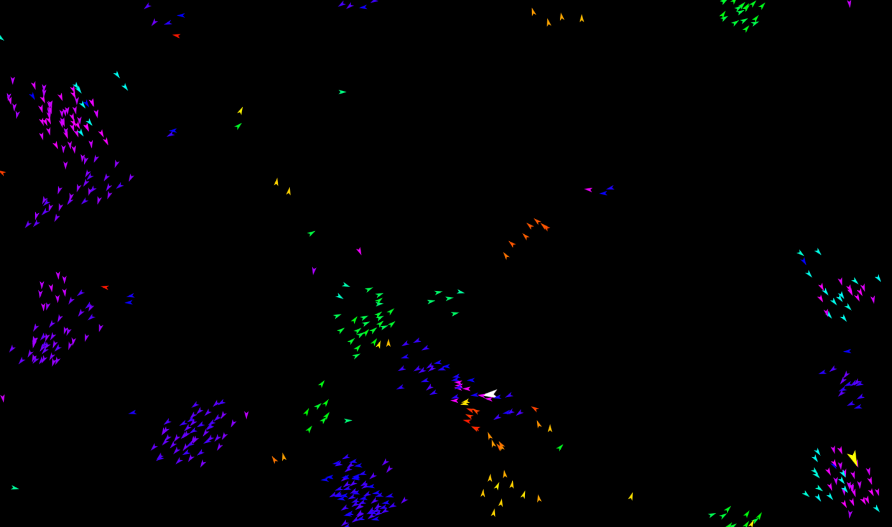
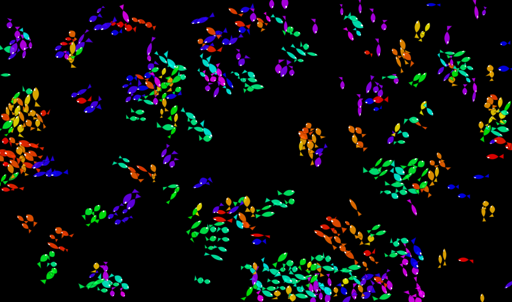
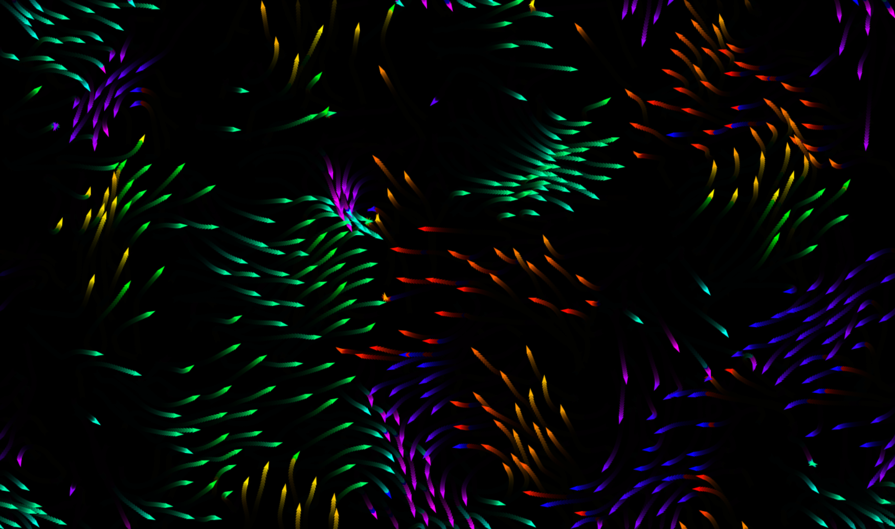
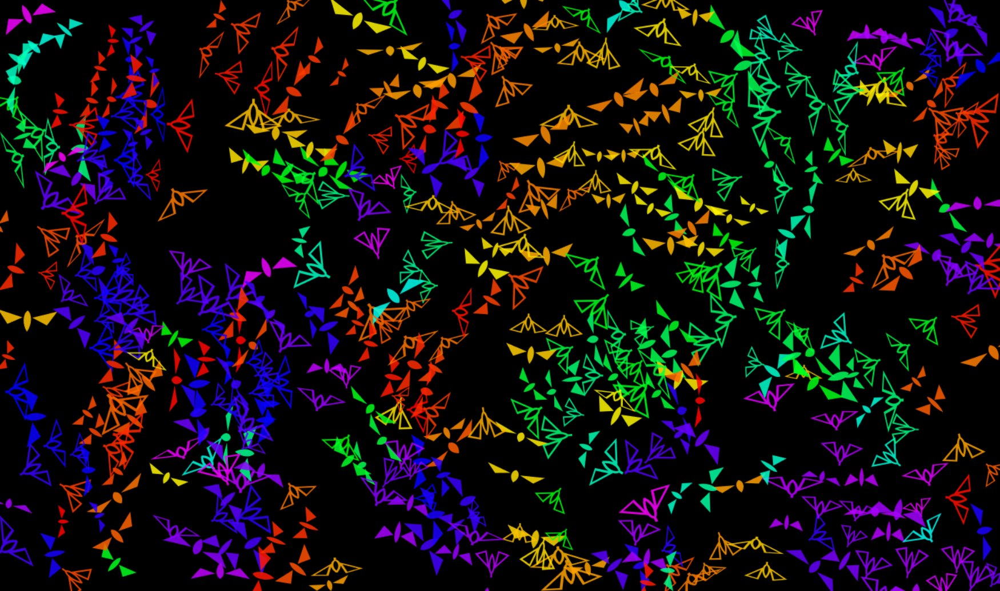
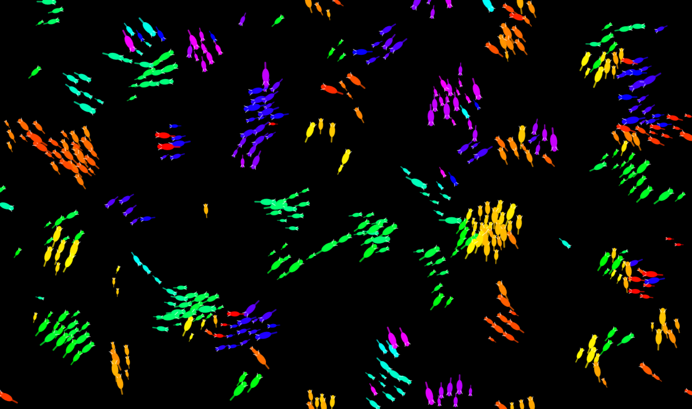
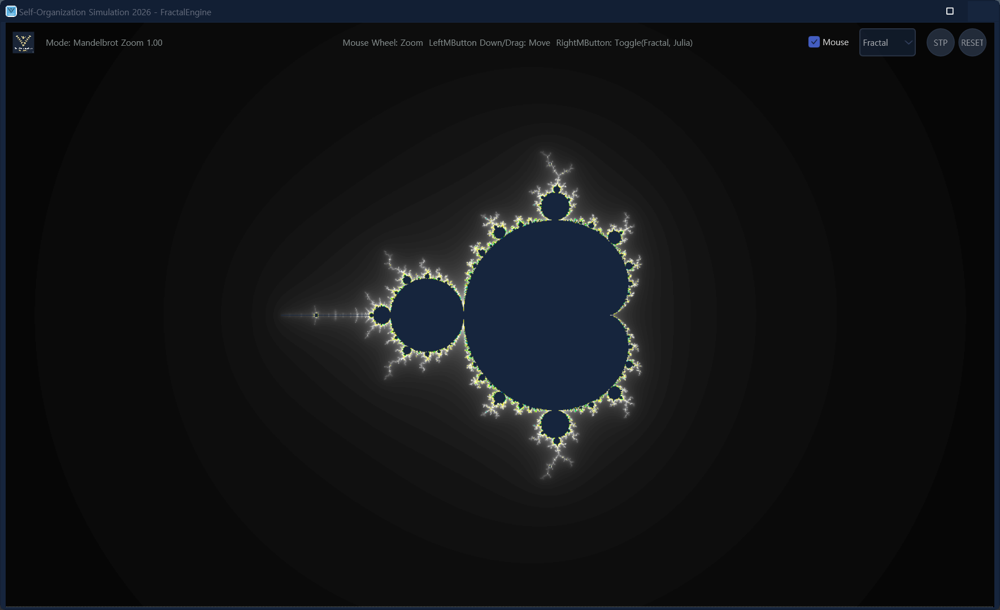
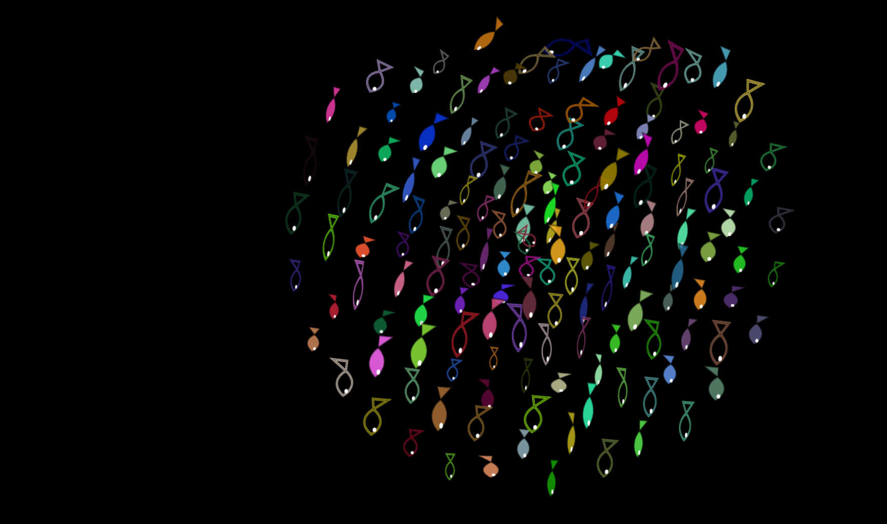

# Self-Organization Simulation 1.0

**Self-Organization Simulation** is a high-performance flocking algorithm implemented in **Delphi FMX (FireMonkey)**. This project merges classical Boids logic with the Vicsek Model to simulate sophisticated, self-organizing collective motion.

## 🚀 Overview
The simulation explores how complex global patterns emerge from simple local interactions. By combining two influential models, it demonstrates the transition from chaotic movement to highly ordered, synchronized structures without central control.

*   **Boids Model (Reynolds):** Handles social forces like collision avoidance and group cohesion.
*   **Vicsek Model:** Focuses on alignment dynamics, where particles synchronize headings based on the average direction of neighbors.
*   **Self-Organization:** Showcases decentralized consensus-building through local feedback loops.

## 🛠 Key Features
*   **Hybrid Flocking Rules:** Integrates Vicsek Alignment for directional order with Boids Cohesion and Separation for spatial balance.
*   **Parallel Optimization:** Physics calculations utilize the `System.Threading` library. By leveraging `TParallel.For`, the engine simulates thousands of particles smoothly on multi-core CPUs.
*   **Interactive Controls:**
    *   **Hover (Attract):** Attracts particles to the cursor to test flock stability.
    *   **Click (Panic):** Triggers a disruption, forcing the system to re-organize from a state of chaos.

## 🎮 How It Works
1.  **Local Perception:** Each agent senses its immediate neighborhood to calculate spatial and directional averages.
2.  **Parallel Physics Step:** The engine processes complex interactions simultaneously across all available CPU cores.
3.  **Double Buffering:** Rendering is performed on a back-buffer bitmap (`TBitmap`) to ensure flicker-free, high-frame-rate visualization.

## 💻 Technical Stack
*   **Language:** Delphi (Object Pascal)
*   **Framework:** FireMonkey (FMX)
*   **Concurrency:** `System.Threading` (TParallel)
*   **Target:** Delphi 12, optimized for statistical physics and interactive visual complexity.

Developed with a focus on self-organized systems, performance, and the aesthetic beauty of emergent collective behavior.

## 🚀 Snapshots

* Main Form

* Sample 1 (Vicsek Model Simulation)

* Sample 2 (Boids Model Simulation)

* Sample 3 (Boids Model Simulation)

* Sample 4 (Boids Model Simulation)

* Sample 5 (Boids Model Simulation)

* Sample 6 (Extra - Fractal)

* Sample 6 (Extra - Aquarium)

